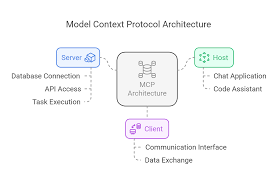
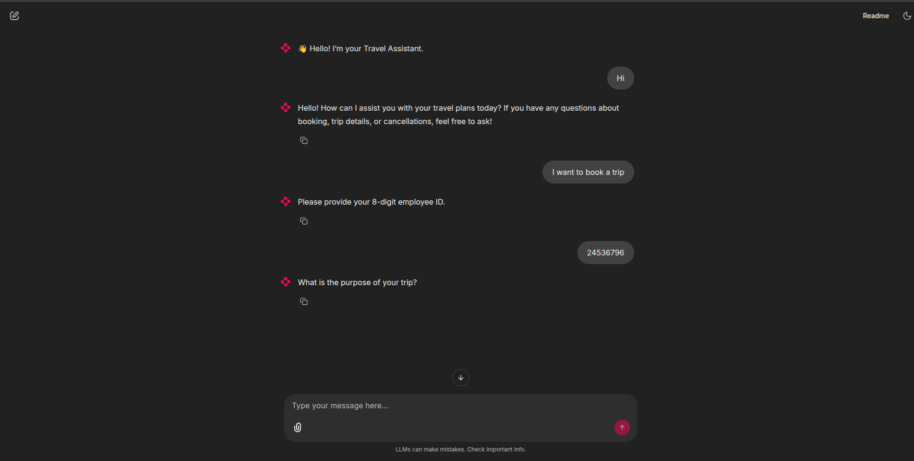

# Travel Bot

---

https://github.com/user-attachments/assets/7fbf9fe4-6f82-4595-a516-2d4a1ce1397d

# Table of contents

1. [Project structure](#project-structure)
2. [High-level architecture](#high-level-architecture)
3. [The MCP approach — deep dive](#the-mcp-approach---deep-dive)
4. [The LangGraph approach — deep dive](#the-langgraph-approach---deep-dive)
5. [Frontend options: Streamlit & Chainlit](#frontend-options-streamlit--chainlit)
6. [Setup & installation (local dev)](#setup--installation-local-dev)
7. [Environment variables](#environment-variables)
8. [How to run (quick start)](#how-to-run-quick-start)
9. [API surface & sample calls](#api-surface--sample-calls)
10. [Prompts & prompt engineering notes](#prompts--prompt-engineering-notes)
11. [Troubleshooting & common errors](#troubleshooting--common-errors)
12. [Testing & QA suggestions](#testing--qa-suggestions)
13. [Design tradeoffs & recommendation](#design-tradeoffs--recommendation)
14. [Docs images (placeholders) — where to place them](#docs-images-placeholders---where-to-place-them)
15. [Contributing & License](#contributing--license)

---

# Project structure

Command used to print structure: `python3 structure.py` — current output:

```
├── app.py
├── chainlit.md
├── client.py
├── langgraph
│   ├── app copy.py
│   └── main copy.py
├── main.py
├── pyproject.toml
├── requirements.txt
├── src
└── structure.py
```

Important files and folders:

* `main.py` — **MCP server** using `FastMCP` (tools: `new_travel_request`, `travel_data_collected`, `out_of_domain_tool`).
* `client.py` — **FastAPI wrapper / MCP client** that spawns the MCP server stdio subprocess using `mcp-python-client` / `ClientSession` and exposes `/chat` endpoint consumed by frontends.
* `app.py` — **Streamlit** frontend (older) or **Chainlit** frontend (migrated version) depending on which `app.py` you run (you may have multiple copies).
* `langgraph/main copy.py`, `langgraph/app copy.py` — **LangGraph** implementation (custom orchestrator + Chainlit frontend).
* `requirements.txt` / `pyproject.toml` — dependency list.
* `chainlit.md` — notes for Chainlit usage or configuration.

> Tip: Keep `main.py` and `client.py` as the canonical MCP implementation and keep `langgraph/` as an alternate approach (experimental). Keep `app.py` for Chainlit UI (rename other copies like `app_streamlit.py` to avoid confusion).

---

# High-level architecture

## Two parallel approaches

1. **MCP approach (recommended)**

   * `main.py` runs as an MCP server: it **registers callable tools** (Python functions) with `FastMCP`.
   * A client (in `client.py`) uses `mcp-python-client` / `ClientSession` or `stdio_client` to connect to the server process over STDIO (or run `mcp.run(transport="http")` for HTTP/SSE).
   * A FastAPI wrapper (`client.py` as server) exposes `/chat` and selects which tool to invoke (router prompt) and calls that tool via MCP.
   * Frontend (Chainlit) calls `POST /chat` and displays the assistant response.

2. **LangGraph approach (alternate)**

   * `langgraph/main copy.py` defines a `StateGraph` workflow: `select_tool` → `call_tool` nodes.
   * The graph calls the LLM for tool selection and then calls local functions directly.
   * `langgraph/app copy.py` (Chainlit) calls a FastAPI endpoint `/agent` that executes the graph and returns the result.

Both approaches use Azure OpenAI (via `langchain_openai.AzureChatOpenAI`) in this repo. Both store simple in-memory `data` (employee\_id and `travel_data`) for session-less demo purposes. For production you should persist per-user session to DB.

---

# The MCP approach — deep dive

## What MCP is (short)

Model Context Protocol (MCP) provides a standardized way to:

* Expose "tools" (functions) a server can run,
* Allow LLMs and clients to discover available tools (`list_tools`),
* Call tools in a structured manner (`call_tool`),
* Use multiple transports (stdio, HTTP/SSE, WebSocket), and
* Enable orchestration across systems.

## How it's used here

* `main.py` registers functions with `@mcp.tool()`:

  * `new_travel_request(user_query: str) -> str`: captures employee ID (expects 8-digit).
  * `travel_data_collected(messages: list[dict]) -> dict/str`: collects travel details and returns JSON or plain `response`.
  * `out_of_domain_tool(messages: list[dict]) -> str`: polite redirect for non-travel input.

* `client.py` runs a small FastAPI app that:

  * Spawns `main.py` subprocess (stdio) using `StdioServerParameters` + `stdio_client`.
  * Keeps a `ClientSession` to call `list_tools()` and `call_tool(...)`.
  * Provides `/chat` endpoint. It does:

    1. Build a compact *selector prompt* (available tools + conversation).
    2. Ask an LLM which tool to call (or pick heuristics / call travel tool directly for 8-digit ID).
    3. Call chosen tool via MCP and return a cleaned assistant response.

## Advantages of MCP here

* Tools are discoverable: any client can ask the server what tools it provides.
* Decouples LLM orchestration and tool implementation.
* Interchangeable transports.
* Easier to integrate multiple servers (HR server, payments server, travel server).

---

# The LangGraph approach — deep dive

## What LangGraph does

LangGraph models conversation logic with nodes and edges. You define a state type (`AgentState`) and create nodes (functions) that manipulate state and call LLM. It's a custom finite-state graph + LLM orchestration.

## How it's used here

* `main copy.py` uses `StateGraph`:

  * `select_tool(state)` — LLM returns one tool name (string).
  * `call_selected_tool(state)` — calls the selected function from `TOOL_REGISTRY`.
* `app copy.py` uses Chainlit to call FastAPI `/agent` which drives the graph.

## Strengths & differences

* Very deterministic flow — you control node transitions and function calling order.
* Easier to reason about complex workflows with branching and retries.
* Tighter coupling between graph and tools (good for domain-specific controlled flows).

## Tradeoffs vs MCP

* Not easily discoverable by external clients — custom architecture.
* Harder to plug new services dynamically compared to MCP.
* Good when workflow must be tightly controlled and deterministic.

---

# Frontends: Streamlit vs Chainlit

## Streamlit

* Quick to spin up, familiar for dashboards.
* Chat UI is possible but requires custom styling for good UX (we implemented a polished `app.py` with CSS).
* Not optimized for streaming assistant typing or chat-centric features.

## Chainlit (recommended for chat)

* Built for chatbots: delivers avatars, typing indicators, markdown rendering, steps, streaming messages, and developer tools.
* Simplifies frontend code: you send assistant messages and Chainlit handles rendering.
* Use Chainlit when you want a production chat-like UX fast.

---

# Setup & installation (local dev)

1. Create & activate Python environment:

```bash
python -m venv .venv
source .venv/bin/activate
pip install -r requirements.txt
```

(If you use conda: `conda create -n api_agent python=3.10 && conda activate api_agent` and then `pip install -r requirements.txt`.)

2. Install tools used by repo:

* `fastmcp` (for server)
* `mcp-python-client` (client)
* `fastapi`, `uvicorn`
* `langchain-openai` (Azure client)
* `chainlit` (frontend)
* `loguru`, `python-dotenv`, etc.

Example `requirements.txt` snippet:

```
fastmcp
mcp-python-client
fastapi
uvicorn
langchain-openai
chainlit
loguru
python-dotenv
requests
```

3. Put your Azure OpenAI keys in a `.env` file (see next section).

---

# Environment variables

Create `.env` at project root:

```
AZURE_OPENAI_API_KEY=your_api_key_here
AZURE_OPENAI_ENDPOINT=https://<your-resource-name>.openai.azure.com
AZURE_OPENAI_API_VERSION=2024-02-15-preview
AZURE_OPENAI_DEPLOYMENT=gpt-4o-mini
```

If your code uses different env names (e.g., `AZURE_OPENAI_DEPLOYMENT`), make sure they match.

---

# How to run (quick start)

### Option A — run the MCP server (stdio) and the FastAPI client wrapper (recommended dev flow)

1. Start FastAPI wrapper (it spawns the MCP server as a stdio subprocess):

```bash
uvicorn client:app --reload
```

* This will:

  * Start a FastAPI server at `http://127.0.0.1:8000`.
  * Inside startup, spawn `python main.py` as a subprocess and create an MCP `ClientSession` over stdio.
  * Use `/chat` endpoint for frontends.

2. Start Chainlit frontend:

```bash
chainlit run app.py -w
```

* Interact in the Chainlit UI (it will call `POST http://127.0.0.1:8000/chat`).

### Option B — run main.py directly (HTTP transport)

If you modify `main.py` to run HTTP transport:

```python
# in main.py
mcp.run(transport="http", host="127.0.0.1", port=8888)
```

Then call tools over HTTP/SSE (client needs to support it). This avoids stdio subprocess and is suitable for production.

---

# API surface & sample calls

### Endpoint: `POST /chat`

* Body: plain text (user message).
* Header: `X-History`: optional conversation history (string).
* Returns: assistant reply (plain text). On errors it returns a short error message.

**Sample curl**:

```bash
curl -X POST "http://127.0.0.1:8000/chat" \
  -H "Content-Type: text/plain" \
  -d "I want to book a trip from Mumbai to Pune on 2025-09-15"
```

### Expected behavior:

* If the message is 8-digit number → `new_travel_request` will capture employee id.
* If travel details → `travel_data_collected` will be called and return a confirmation message.
* If offtopic → `out_of_domain_tool` politely declines.

---

# Prompts & prompt-engineering notes

### General guidelines used in this project:

* Keep selector prompts **concise** and **rule-driven**: give the LLM enough context to choose a single tool.
* Prefer **structured JSON output** from LLM when you want machine-readability (tools), but **unwrap** to human-readable text for UI.
* Use **local heuristics** before calling the LLM to reduce cost (e.g., exact 8-digit detect).
* Use **robust parsing**: always `json.loads` safely and accept double-encoded JSON strings.
* Keep **explicit constraints** (date format, example outputs) but avoid long enumerations that can be ignored by the model.

### Example selector prompt (compact)

```
You are a tool selector. Tools: new_travel_request, travel_data_collected, out_of_domain_tool.
Conversation (last messages): ...
User now says: "<input>"
Rules:
- If input is exactly 8 digits → "new_travel_request".
- If input contains travel details and employee_id exists → "travel_data_collected".
- If unrelated → "out_of_domain_tool".
Return JSON only: {"tool":"<tool-name>", "arguments":{...}} OR plain answer if no tool is needed.
```

---

# Troubleshooting & common errors

### `ImportError: cannot import name 'serve_stdio' from 'mcp.server'`

* Fix: Use `FastMCP.run()` directly; `serve_stdio` was removed/deprecated.

### `ImportError: cannot import name 'Client' from 'mcp'`

* Fix: Use `mcp-python-client` package (e.g., `from mcp_python_client import MCPClient`) or low-level `ClientSession` with `stdio_client`.

### Backend returning escaped JSON in UI

* Fix backend to unwrap `{"response":...}` into plain text, or sanitize in frontend (Chainlit) by parsing and extracting `response` (the recommended approach is to fix backend so the UI always gets plain text for simple replies).

### LLM parsing errors (invalid JSON)

* Solution:

  * Add explicit example outputs in prompts that produce JSON (show exactly expected structure).
  * Use `try: json.loads()` with fallback.
  * Accept double-encoded JSON strings and parse twice.

---

# Testing & QA suggestions

* **Unit tests for prompt parsing**: feed model-like strings and test `safe_json_load` logic.
* **Integration tests**:

  * Start server in CI (or as subprocess) and run example flows via HTTP client.
  * Mock LLM responses in tests to validate state transitions.
* **Manual test cases**:

  * 8-digit ID only → should capture employee id.
  * Purpose only after id → should call travel collection tool.
  * Full details in single message → should parse and respond with summary + `confirm`.
  * `confirm` → should result in booking confirmation message (if implemented).
* **Load testing**: test client `list_tools` calls frequency and cache them to avoid repeated LLM calls.

---

# Design tradeoffs & recommendation

* If you want **modularity, future integrations, multi-service orchestration**, use **MCP** (recommended).
* If you need a **single, deterministic flow** (complex business rules), **LangGraph** is good.
* For clean frontend UX use **Chainlit** (chat-focused); use Streamlit for dashboards.

**Recommendation**: Use MCP as the core pattern + Chainlit as UI. Keep LangGraph as a specialized experiment for flows that require deterministic branching.

---

# Docs images (placeholders) — where to place them

Create `/docs` or `/images` and add three images (PNG/SVG). Reference them in README with these names and captions.

1. `docs/architecture.png` — **Architecture Diagram (MCP vs LangGraph)**

   * Shows: Client (Chainlit/Streamlit) → FastAPI wrapper → MCP ClientSession → MCP Server (`main.py`) with tools; and separate LangGraph flow.
   * Caption: "High-level architecture showing the MCP pipeline and LangGraph alternative."
   
   
   

2. `docs/ui_preview.png` — **UI screenshot (Chainlit)**

   * Shows: conversation with avatars, sample messages, final booking summary formatted in markdown.
   * Caption: "Chainlit chat UI with avatars and a formatted booking summary."


   
   
   *Figure 2 — Chainlit chat UI screenshot.*
   

> Tip: for each image, include a small alt text for accessibility, and keep them in `docs/` to avoid clutter.

---

# Contributing & License

* Contributions welcome. Please:

  * Open an issue describing changes.
  * Add PRs against `main` with tests and documentation.
  * Keep changes backward compatible.

* Suggested `LICENSE`: MIT (change as desired).

---

# Example conversation (end-to-end)

1. **User**: `I want to book a trip`
   → Selector decides: `new_travel_request` or asks LLM to choose. Server responds: `Please provide your 8-digit Employee ID.`

2. **User**: `23456789`
   → `new_travel_request` captures ID and returns: `Got your ID. What's your travel purpose and destination?`

3. **User**: `R&D Project, Mumbai to Pune, 15th sept 2025 9am to 20th sept 2025 10pm, Round trip, Train, Sleeper, Self Booked`
   → `travel_data_collected` returns parsed travel details plus ask for `cost_center` / `project_wbs`.

4. **User**: `607402 and ADRG.25IT.DG.GE.A01`
   → `travel_data_collected` returns a formatted summary and asks `reply 'confirm' to book or 'no' to edit`.

5. **User**: `confirm`
   → Server returns: `✅ Your trip is booked!` (and you persist to DB in production).

---

# Final notes & next steps

* Add persistent session storage (per-user) — current in-memory `data` is demo-only.
* Add authentication to the FastAPI endpoints for security.
* Add unit tests for prompt parsing and JSON extraction.
* Add monitoring and logging around LLM calls to watch cost & failures.
* Consider running MCP server over HTTP/SSE in production for simpler scaling (no subprocess).

---

If you want, I can:

* Generate the three diagrams for you (architecture, sequence, UI preview) as PNGs and place them in `docs/`.
* Create a `README.md` file and save it into the repo for you.
* Add example Postman collection or OpenAPI docs for `/chat`.

Tell me which of those you’d like me to do next and I’ll produce them immediately.
